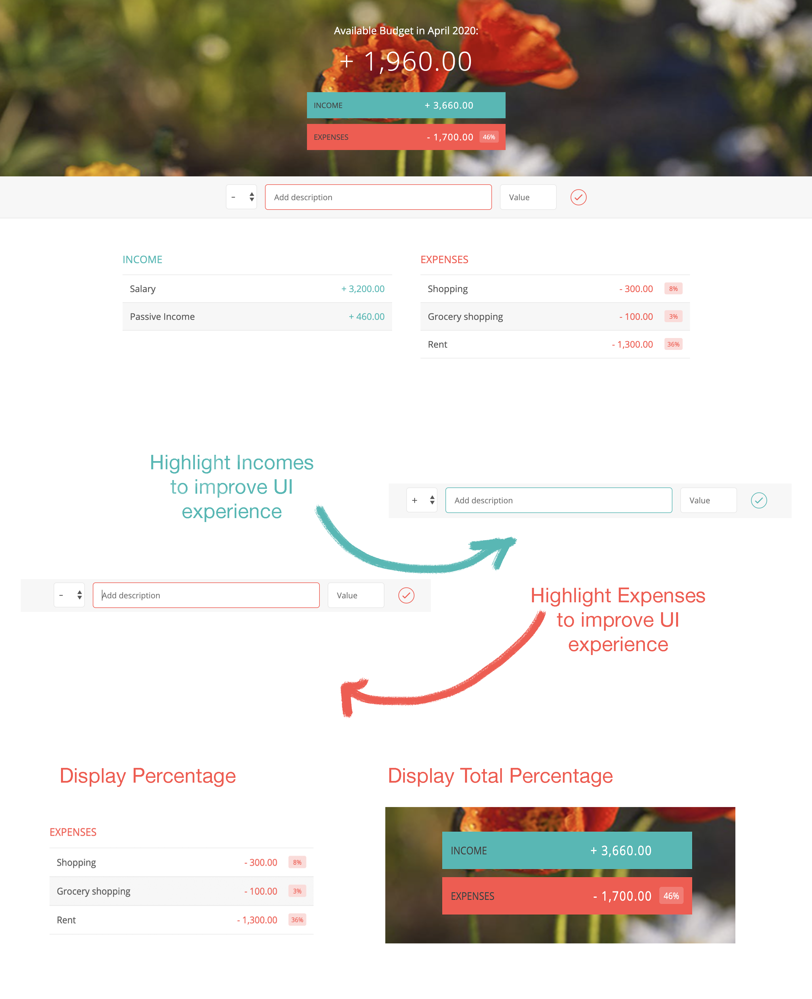

# Budget Controller App

Just a pure JavaScript budget app based in one of the projects of The Complete JavaScript Course on Udemy taught by Jonas Schmedtmann. It is mainly focused on implementing JavaScript. You can add your income and expenses and it'll calculate how much budget you have for the month.
You can click [HERE](https://anneliseschulzz.github.io/budget-controller-app/) to see a demo and plan your budget for this month!

## 💻 Build with

- HTML5
- CSS3
- Vanilla JaveScript (ES5)

## 📷 Screen Shot

